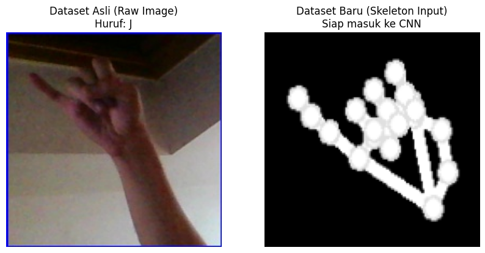
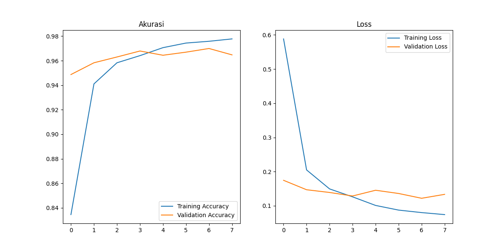
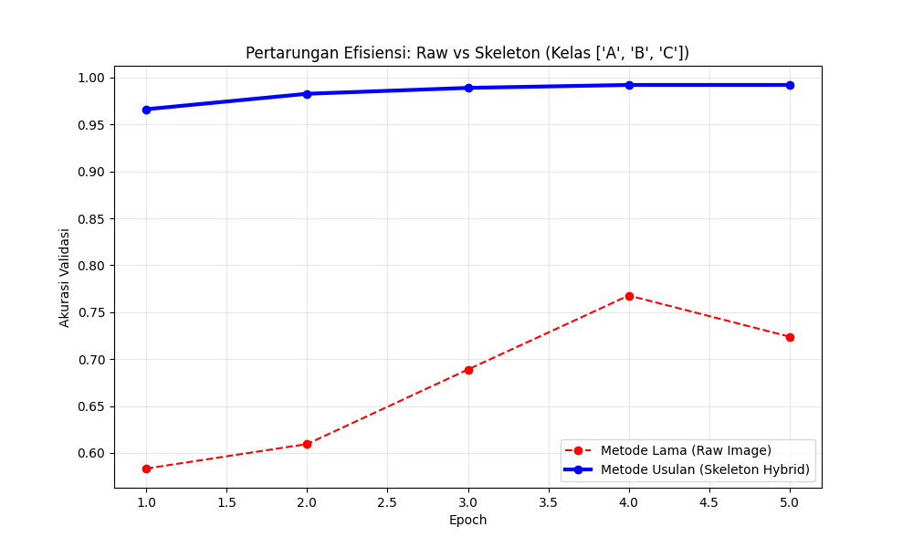

# 🖐️ Real-Time ASL Recognition System (Hybrid Skeleton-CNN)

> **Sistem Penerjemah Bahasa Isyarat Amerika (ASL) berbasis Computer Vision yang robust terhadap gangguan latar belakang.**


---

## 📖 Tentang Proyek

Proyek ini bertujuan untuk menjembatani komunikasi bagi penyandang disabilitas dengan menerjemahkan gestur tangan alfabet ASL (A–Z) menjadi teks secara *real-time* menggunakan kamera laptop.

Berbeda dengan pendekatan CNN konvensional yang memproses citra mentah (*raw RGB*), sistem ini menggunakan metode **Hybrid Feature Extraction**, yaitu:

1. **Landmark Detection**  
   Menggunakan **MediaPipe** untuk mengekstraksi 21 titik koordinat sendi tangan.

2. **Skeleton Generation**  
   Menggambar ulang struktur tulang tangan di atas kanvas hitam (*black canvas*) untuk menghilangkan *noise*.

3. **Classification**  
   Citra skeleton yang telah dibersihkan diproses menggunakan **CNN (Convolutional Neural Network)**.

---

## 🎥 Demo Aplikasi


---

## 🚀 Keunggulan Metode

- ✅ **Akurasi Tinggi**: Mencapai **98–99%** pada data uji  
- ✅ **Robust terhadap Lighting**: Tetap optimal di kondisi minim cahaya  
- ✅ **Background Invariant**: Tidak terpengaruh latar belakang kompleks  
- ✅ **Privacy Friendly**: Hanya memproses data tangan (tanpa wajah)  

---

## 📂 Struktur Repository

| File | Deskripsi |
|------|----------|
| `app.py` | Program utama untuk deteksi real-time via webcam |
| `konversi_dataset.py` | Preprocessing dataset menjadi skeleton |
| `latih_cnn_tulang.py` | Script training model CNN |
| `asl_cnn_skeleton.h5` | Model pre-trained |
| `requirements.txt` | Daftar dependency |

---

## 🛠️ Instalasi & Cara Penggunaan

### 1. Clone Repository
```bash
git clone https://github.com/USERNAME_KAMU/NAMA_REPO.git
cd NAMA_REPO
```

### 2. Install Dependencies
```bash
pip install -r requirements.txt
```

### 3. Jalankan Program
```bash
python app.py
```

> **Catatan:**  
> Jika file utama belum diubah:
> ```bash
> python uji_kamera.py
> ```

---

## ⚙️ Requirements

- Python 3.x  
- Webcam / Kamera aktif  
- Library sesuai `requirements.txt`  

---

## 📊 Hasil Evaluasi & Analisis

### 1. Transformasi Input Data

Sistem mengubah citra mentah yang penuh *noise* menjadi representasi geometris yang lebih stabil.

  
*Kiri: Citra asli (raw) | Kanan: Citra skeleton*

---

### 2. Performa Model

Model dilatih selama 10 epoch dan menunjukkan konvergensi stabil tanpa indikasi overfitting signifikan.



---

### 3. Studi Komparasi

Perbandingan antara metode CNN konvensional dan pendekatan skeleton menunjukkan:

- Training lebih cepat  
- Generalisasi lebih baik  
- Stabil terhadap variasi lingkungan  



---

## 👥 Tim Pengembang

Proyek ini disusun untuk memenuhi Ujian Tengah Semester (UTS)  
Mata Kuliah: **Kecerdasan Buatan**

- Krisna Wibowo (06024010)  
- Peris Trisna Wati Nazara (06024011)  
- Daffa Kuswardana (06024015)  

---

## ❤️ Acknowledgement

Dibuat menggunakan:
- Python  
- TensorFlow  
- MediaPipe  

---
